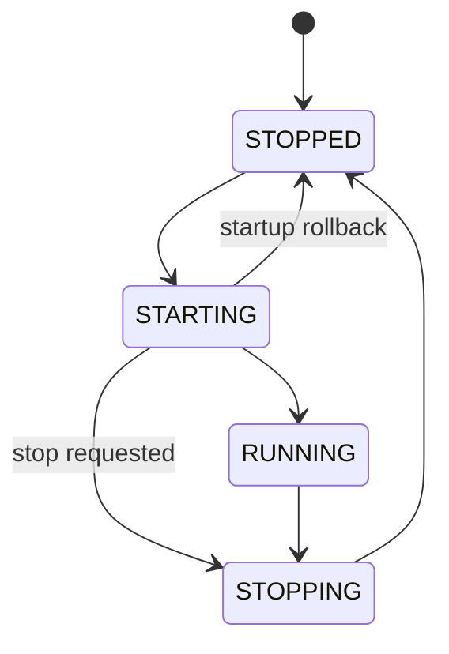
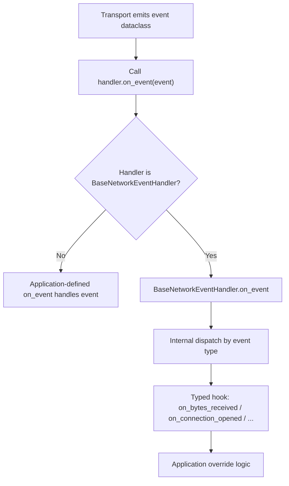

# aionetx

[](https://github.com/MarcusKorinth/aionetx/actions/workflows/ci.yml)
[](https://github.com/MarcusKorinth/aionetx/blob/main/pyproject.toml)
[](https://github.com/MarcusKorinth/aionetx/blob/main/.github/workflows/ci.yml)
[](https://github.com/MarcusKorinth/aionetx/blob/main/src/aionetx/py.typed)
[](LICENSE)
[](https://www.bestpractices.dev/projects/12644)
[](https://securityscorecards.dev/viewer/?uri=github.com/MarcusKorinth/aionetx)

`aionetx` is an asyncio-first transport library for reusable TCP and UDP communication primitives.

It provides explicit lifecycle management and structured event delivery for networking code that would otherwise require manual coordination with raw `asyncio` (startup/shutdown, reconnect handling, and event routing).

Protocol framing, parsing, and business logic remain in your application.

> **Design principle:** hide the plumbing, not the semantics. Startup, shutdown, reconnect, and event delivery are handled for you; connection lifecycle, error visibility, and byte boundaries are not.

---

## Development status

`aionetx` is a **pre-1.0 transport library**. Its public API may still evolve when changes materially improve long-term transport, lifecycle, or observability quality.

- the project is usable for real integration work, but API/runtime details may still change when they improve the long-term transport boundary
- it is not advertised as production-ready; production adoption should pin a version, test the exact transport paths used, and treat `0.x` releases as pre-stable
- semantic contracts (lifecycle clarity, event ordering, explicit failure behavior) are treated as the design center
- changes in `0.x` should be deliberate, documented, and justified by a clearer long-term transport boundary

---

## Table of Contents

- [Development status](#development-status)
- [Why this project exists](#why-this-project-exists)
- [What this library is for](#what-this-library-is-for)
- [What this library is not for](#what-this-library-is-not-for)
- [When to use aionetx](#when-to-use-aionetx)
- [When not to use aionetx](#when-not-to-use-aionetx)
- [Positioning and comparison](#positioning-and-comparison)
- [Quick start (factory-first)](#quick-start-factory-first)
- [Recommended entry path (start here)](#recommended-entry-path-start-here)
- [Core concepts](#core-concepts)
  - [Transport roles and capability matrix](#transport-roles-and-capability-matrix)
  - [Lifecycle model](#lifecycle-model)
  - [Unified event integration](#unified-event-integration)
  - [Event delivery and backpressure](#event-delivery-and-backpressure)
- [Practical examples](#practical-examples)
  - [Buffer TCP chunks into fixed-size frames (1359 bytes)](#1-buffer-tcp-chunks-into-fixed-size-frames-1359-bytes)
  - [Receive bytes with one handler](#2-receive-bytes-with-one-handler)
  - [Reconnect + heartbeat client](#3-reconnect--heartbeat-client)
  - [UDP sender/receiver usage](#4-udp-senderreceiver-usage)
- [Public API overview](#public-api-overview)
- [Verification posture and portability](#verification-posture-and-portability)
- [Testing helpers (`aionetx.testing`)](#testing-helpers-aionetxtesting)
- [FAQ](#faq)
- [Documentation map](#documentation-map)
- [Installation and local development](#installation-and-local-development)
- [Logging and troubleshooting](#logging-and-troubleshooting)
- [Production checklist](#production-checklist)

---

## Why this project exists

`asyncio` gives excellent low-level networking primitives, but production transport code often repeats the same difficult parts:

- lifecycle orchestration (`start`/`stop`/shutdown paths)
- reconnect loops and heartbeat scheduling
- event dispatch plumbing and backpressure behavior
- consistent error surfacing and observability

`aionetx` packages those recurring concerns into explicit, reusable transport primitives. It reduces repetitive code without hiding behavior that operators and developers must reason about.

---

## What this library is for

Use `aionetx` when you want:

- TCP client and server transport primitives
- UDP receiver and sender primitives
- UDP multicast receiver support
- explicit lifecycle visibility for managed transports
- event-driven integration through one async callback contract
- configurable dispatch mode and backpressure policy
- optional reconnect for TCP clients and optional heartbeat for managed TCP roles

Canonical scope reference: `docs/architecture.md` (**Purpose and boundary**).

---

## What this library is not for

`aionetx` intentionally does **not** implement:

- message framing or protocol boundaries for TCP
- protocol parsers/state machines (MQTT/Modbus/HTTP/etc.)
- serialization/deserialization
- business logic and domain workflows

Those belong in higher layers. For detailed in-scope/out-of-scope and deferred-area criteria, see `docs/architecture.md` (**Purpose and boundary** + **Current limitations and explicit non-goals**).

---

## When to use aionetx

- custom TCP/UDP protocols
- systems requiring explicit lifecycle control
- event-driven network processing
- applications where testability and determinism matter

## When not to use aionetx

- simple scripts where raw asyncio is sufficient
- HTTP/REST services (use higher-level frameworks)
- cases where lifecycle and event structure are unnecessary

---

## Positioning and comparison

`aionetx` sits between low-level `asyncio` primitives and higher-level protocol or application frameworks.

### Compared to raw asyncio

`asyncio` provides flexible but low-level building blocks for networking.  
In real-world systems, this typically leads to repeated implementation of:

- lifecycle coordination (`start` / `stop` / shutdown behavior)
- reconnect logic and retry loops
- event routing and handler dispatch
- backpressure and error propagation

`aionetx` standardizes these concerns into explicit, reusable transport components while keeping behavior visible and controllable.

It does not replace `asyncio`, but structures its usage.

---

### Compared to higher-level frameworks

Higher-level frameworks (e.g. HTTP servers, messaging libraries, protocol-specific stacks) usually provide:

- built-in protocol handling
- serialization / deserialization
- domain-level abstractions

`aionetx` intentionally does not operate at that level.

It focuses strictly on transport concerns:
- connection lifecycle
- byte-level data flow
- event delivery
- reconnect and heartbeat behavior

Protocol handling remains entirely in user code.

---

### When this abstraction is useful

`aionetx` is most useful when:

- you implement custom TCP or UDP protocols
- you need explicit control over connection lifecycle
- you want structured event-driven integration
- you require deterministic and testable transport behavior
- you want to avoid reimplementing transport plumbing across projects

If your use case is fully covered by an existing high-level framework, using that framework is usually the better choice.

---

## Quick start (factory-first)

The recommended entrypoint is `AsyncioNetworkFactory`. The tiny client below
assumes a TCP server is already listening on `127.0.0.1:9000`; for a fully
self-contained roundtrip, use
[`examples/tcp_echo_server_and_client.py`](examples/tcp_echo_server_and_client.py).

```python
import asyncio

from aionetx import (
    AsyncioNetworkFactory,
    BaseNetworkEventHandler,
    BytesReceivedEvent,
    TcpClientSettings,
)


class Handler(BaseNetworkEventHandler):
    async def on_bytes_received(self, event: BytesReceivedEvent) -> None:
        print(f"{event.resource_id} -> {event.data!r}")


async def main() -> None:
    factory = AsyncioNetworkFactory()

    client = factory.create_tcp_client(
        settings=TcpClientSettings(host="127.0.0.1", port=9000),
        event_handler=Handler(),
    )

    await client.start()
    try:
        conn = await client.wait_until_connected(timeout_seconds=5.0)
        await conn.send(b"hello")
    finally:
        await client.stop()


if __name__ == "__main__":
    asyncio.run(main())
```

`wait_until_connected()` is timeout-aware and unblocks deterministically if the client stops before becoming ready.

---

## Recommended entry path (start here)

If you are new to `aionetx`, start with this small subset of root exports before exploring the full curated API surface.

| Tier | Name | Purpose | When to use |
| --- | --- | --- | --- |
| Stable/common | `AsyncioNetworkFactory` | Factory-first entrypoint for constructing transport objects. | Always start here for new integrations. |
| Stable/common | `TcpClientSettings` | Configuration dataclass for TCP clients. | When creating outbound TCP client transports. |
| Stable/common | `TcpServerSettings` | Configuration dataclass for TCP servers. | When accepting inbound TCP connections. |
| Stable/common | `UdpReceiverSettings` | Configuration dataclass for UDP receive endpoints. | When listening for datagrams (unicast UDP). |
| Stable/common | `UdpSenderSettings` | Configuration dataclass for UDP send endpoints. | When sending datagrams without managed receive lifecycle. |
| Stable/common | `EventDeliverySettings` | Dispatcher mode, buffering, and handler-failure policy controls. | When tuning ordering/throughput/backpressure behavior. |
| Stable/common | `TcpReconnectSettings` | Explicit reconnect policy controls for TCP clients. | When client reconnect behavior must be deterministic and observable. |
| Stable/common | `TcpHeartbeatSettings` | TCP heartbeat scheduling configuration. | When link-liveness probing is needed at the transport layer. |
| Stable/common | `HeartbeatProviderProtocol` | Heartbeat payload provider contract. | When heartbeat bytes must be generated dynamically. |
| Stable/common | `MulticastReceiverSettings` | Configuration dataclass for UDP multicast receive endpoints. | When listening to multicast groups. |
| Stable/common | `BytesReceivedEvent` | Canonical payload event for incoming byte streams. | When implementing TCP receive behavior in handlers. |
| Stable/common | `NetworkEvent` | Unified event type contract for `on_event`. | When authoring direct event-driven handlers. |
| Stable/common | `BaseNetworkEventHandler` | Convenience typed hooks (`on_bytes_received`, `on_connection_closed`, etc.). | When avoiding manual `isinstance` dispatch in handlers. |
| Stable/common | `ComponentLifecycleState` | Canonical lifecycle enum (`STOPPED/STARTING/RUNNING/STOPPING`). | When checking lifecycle state directly in code/tests. |

This guide focuses on the default package-root path. Advanced protocol and policy surfaces remain available from `aionetx.api`.

Compatibility note: import advanced protocol surfaces from `aionetx.api` (for example `TcpClientProtocol`, `TcpServerProtocol`, `UdpReceiverProtocol`, `UdpSenderProtocol`).

The consolidated API-boundary and decision rationale now lives in `docs/architecture.md`.

The API remains intentionally evolvable while the transport boundary is still being finalized, but changes should be rare, explicit, and semantically motivated.

---

## Core concepts

### Transport roles and capability matrix

| Transport | Managed lifecycle events | Connection metadata events | Reconnect | Heartbeat | Sending |
| --- | --- | --- | --- | --- | --- |
| TCP client | Yes | Yes | Optional | Optional | Via active connection |
| TCP server | Yes | Yes (per accepted connection) | N/A | Optional (per connection) | Broadcast + per connection |
| UDP receiver | Yes | Yes | N/A | N/A | No |
| UDP multicast receiver | Yes | Yes | N/A | N/A | No |
| UDP sender | No managed lifecycle stream | No connection metadata stream | N/A | N/A | Yes (`send`) |

`UdpSenderProtocol` is intentionally asymmetric: it is a lightweight datagram sender, not a managed event-emitting transport.

### Lifecycle model

Managed components use four explicit states to make startup, shutdown, and transitions observable and testable:

- `STOPPED`
- `STARTING`
- `RUNNING`
- `STOPPING`

Lifecycle state is observable via `component.lifecycle_state` and `ComponentLifecycleChangedEvent`.

Transition semantics include guarded startup rollback and stop-during-startup behavior. Lifecycle authority is consolidated in `docs/architecture.md`.



### Unified event integration

The core integration contract is:

```python
async def on_event(self, event: NetworkEvent) -> None: ...
```

All events flow through this single method.

`NetworkEvent` is the public typing union for supported event dataclasses.  
It is a **type-level contract**, not a shared runtime base class.

`NetworkEvent` is an **open union**: new event dataclasses may be added in
minor releases. Handler code should therefore always keep a catch-all
fallback (`else:` on an `isinstance` chain, `case _:` on `match`) so a
future union extension does not silently break your code. Existing event
field shapes are stable and any addition is called out in `CHANGELOG.md`.
`BaseNetworkEventHandler` already handles this correctly — its typed
hooks are optional overrides and unknown event types fall back to a
default no-op. Removing an event type is a breaking change (reserved for
major releases, or during pre-1.0 for minor bumps with an explicit
**Removed** CHANGELOG entry). Do **not** use `typing.assert_never`
against this union; it assumes a closed taxonomy.

`BaseNetworkEventHandler` provides typed convenience hooks such as `on_bytes_received`, `on_connection_opened`, and `on_connection_closed`. These are internally dispatched from `on_event(...)`.

This means:

- `on_event(...)` is the true public integration contract  
- typed hook methods are optional convenience layers  
- both approaches are equivalent in capability  
- direct API method failures (for example `send(...)` when closed/invalid) are
  raised as explicit exceptions at the call site; managed background failures
  are surfaced through events such as `NetworkErrorEvent`

Constructor and factory boundaries validate that the handler contract is async and raise clear `TypeError` for invalid handlers.

---

#### Event flow



- All events are first delivered to `on_event(...)`
- If you implement your own handler, you handle events directly in `on_event(...)`
- If you subclass `BaseNetworkEventHandler`, it performs an internal dispatch to typed hook methods

---

#### Example using the core contract directly

This form uses the protocol contract only (any object with async `on_event(...)`).

```python
from aionetx import BytesReceivedEvent, NetworkEvent


class Handler:
    async def on_event(self, event: NetworkEvent) -> None:
        if isinstance(event, BytesReceivedEvent):
            print("rx", event.resource_id, event.data)
```

---

#### Example using typed convenience hooks (recommended)

```python
from aionetx import BaseNetworkEventHandler, BytesReceivedEvent


class Handler(BaseNetworkEventHandler):
    async def on_bytes_received(self, event: BytesReceivedEvent) -> None:
        print("rx", event.resource_id, event.data)
```

---

Common event types:

- `BytesReceivedEvent`
- `ConnectionOpenedEvent`
- `ConnectionClosedEvent`
- `NetworkErrorEvent`
- `ComponentLifecycleChangedEvent`

Canonical identity field for filtering and routing is always `event.resource_id`.
For a complete, versioned event surface, treat `NetworkEvent` plus curated
exports in `aionetx` / `aionetx.api` as authoritative.

### Event delivery and backpressure

Each managed transport settings object includes `event_delivery`.

```python
from aionetx import (
    EventDeliverySettings,
    TcpServerSettings,
)
from aionetx.api import EventBackpressurePolicy, EventDispatchMode

settings = TcpServerSettings(
    host="127.0.0.1",
    port=9000,
    max_connections=64,
    event_delivery=EventDeliverySettings(
        dispatch_mode=EventDispatchMode.BACKGROUND,
        backpressure_policy=EventBackpressurePolicy.BLOCK,
        max_pending_events=1024,
    ),
)
```

Dispatch modes:

- `INLINE`: handler runs in the emitter path
- `BACKGROUND` (default): events go through an internal dispatcher queue

Backpressure policies in `BACKGROUND` mode:

- `BLOCK` (default)
- `DROP_OLDEST`
- `DROP_NEWEST`

Per-connection handler execution remains sequential. Cross-connection concurrency depends on topology and dispatcher sharing.
In practice: a single shared BACKGROUND dispatcher worker serializes handler execution across that component, while isolated dispatcher paths can execute concurrently.

Handler failure policy is configurable via `EventDeliverySettings.handler_failure_policy`:

- `log_only` (default)
- `emit_error_event`
- `stop_component`
- `raise_in_inline_mode`

Dispatcher phase behavior in `BACKGROUND` mode is explicit:

- before the dispatcher worker starts, emission falls back to inline delivery
- during steady state, events are delivered by the background worker task
- after dispatcher stop begins, newly emitted events are intentionally dropped to guarantee deterministic shutdown completion

This shutdown-phase drop behavior is a documented exception to steady-state
overload policy.

Operational diagnostics for concrete asyncio implementations now make drop causes
explicit at runtime:

- backpressure drops are tracked separately for `DROP_OLDEST` and `DROP_NEWEST`
- shutdown-phase drops are tracked separately from overload drops
- dispatcher runtime stats include enqueue volume, handler dispatch attempts, and queue depth peak/current snapshots

Concrete asyncio TCP components expose this as `dispatcher_runtime_stats`.

Use those diagnostics to distinguish overload tuning problems from intentional
deterministic-shutdown cutoffs.

For lifecycle/cancellation/shutdown contract details, see `docs/architecture.md` and the runtime/integration tests in `tests/`.

---

## Practical examples

### 1) Buffer TCP chunks into fixed-size frames (1359 bytes)

TCP is stream-oriented. Receive boundaries do not correspond to send boundaries.

If your application protocol uses fixed-size frames, do framing in your handler layer.

```python
from aionetx.api import BytesReceivedEvent, ConnectionClosedEvent, NetworkEvent


FRAME_SIZE = 1359


class FixedFrameHandler:
    def __init__(self) -> None:
        self._buffers: dict[str, bytearray] = {}

    async def on_event(self, event: NetworkEvent) -> None:
        if isinstance(event, BytesReceivedEvent):
            buf = self._buffers.setdefault(event.resource_id, bytearray())
            buf.extend(event.data)

            while len(buf) >= FRAME_SIZE:
                frame = bytes(buf[:FRAME_SIZE])
                del buf[:FRAME_SIZE]
                await self.process_frame(event.resource_id, frame)

        elif isinstance(event, ConnectionClosedEvent):
            self._buffers.pop(event.resource_id, None)

    async def process_frame(self, resource_id: str, frame: bytes) -> None:
        assert len(frame) == FRAME_SIZE
        print(resource_id, "frame", len(frame))
```

This example intentionally uses the core `on_event(...)` contract because it coordinates two event types (`BytesReceivedEvent` and `ConnectionClosedEvent`) in one buffer state machine. The same framing boundary still applies when using typed hooks via `BaseNetworkEventHandler`.

For a longer runnable framing example, see [examples/tcp_framing_length_prefix.py](examples/tcp_framing_length_prefix.py).

### 2) Receive bytes with one handler

This example uses only the core contract (`on_event`). The typed `on_bytes_received(...)` hook shown earlier is a convenience form of the same integration model.

```python
from aionetx import BytesReceivedEvent, NetworkEvent


class Handler:
    async def on_event(self, event: NetworkEvent) -> None:
        if isinstance(event, BytesReceivedEvent):
            payload: bytes = event.data
            print("rx", event.resource_id, payload)
```

### 3) Reconnect + heartbeat client

```python
import asyncio

from aionetx import (
    AsyncioNetworkFactory,
    TcpHeartbeatSettings,
    TcpReconnectSettings,
    TcpClientSettings,
)
from aionetx.api import (
    ConnectionClosedEvent,
    HeartbeatProviderProtocol,
    HeartbeatRequest,
    HeartbeatResult,
    NetworkEvent,
)


class Handler:
    async def on_event(self, event: NetworkEvent) -> None:
        if isinstance(event, ConnectionClosedEvent):
            print("closed", event.resource_id)
        else:
            print(type(event).__name__)


class Provider(HeartbeatProviderProtocol):
    async def create_heartbeat(self, request: HeartbeatRequest) -> HeartbeatResult:
        return HeartbeatResult(
            should_send=True,
            payload=f"HB:{request.connection_id}".encode(),
        )


async def main() -> None:
    client = AsyncioNetworkFactory().create_tcp_client(
        settings=TcpClientSettings(
            host="127.0.0.1",
            port=9000,
            reconnect=TcpReconnectSettings(enabled=True, initial_delay_seconds=0.2),
            heartbeat=TcpHeartbeatSettings(enabled=True, interval_seconds=1.0),
        ),
        event_handler=Handler(),
        heartbeat_provider=Provider(),
    )

    await client.start()
    try:
        conn = await client.wait_until_connected(timeout_seconds=5.0)
        await conn.send(b"hello")
        await asyncio.sleep(0.2)
    finally:
        await client.stop()


if __name__ == "__main__":
    asyncio.run(main())
```

The runnable version of this example also exists at [examples/tcp_reconnect_with_heartbeat.py](examples/tcp_reconnect_with_heartbeat.py).

### 4) UDP sender/receiver usage

```python
import asyncio

from aionetx import (
    AsyncioNetworkFactory,
    BaseNetworkEventHandler,
    BytesReceivedEvent,
    UdpReceiverSettings,
    UdpSenderSettings,
)


class Handler(BaseNetworkEventHandler):
    async def on_bytes_received(self, event: BytesReceivedEvent) -> None:
        print("udp datagram", event.data, event.remote_host, event.remote_port)


async def main() -> None:
    factory = AsyncioNetworkFactory()
    receiver = factory.create_udp_receiver(
        settings=UdpReceiverSettings(host="127.0.0.1", port=20010),
        event_handler=Handler(),
    )
    sender = factory.create_udp_sender(
        settings=UdpSenderSettings(default_host="127.0.0.1", default_port=20010),
    )

    await receiver.start()
    try:
        await sender.send(b"hello over udp")
    finally:
        await sender.stop()
        await receiver.stop()


if __name__ == "__main__":
    asyncio.run(main())
```

---

## Public API overview

The public API is intentionally small and structured around a few core entry points and configuration objects.

Primary root exports include:

- `AsyncioNetworkFactory`
- settings dataclasses: `TcpClientSettings`, `TcpServerSettings`, `UdpReceiverSettings`, `UdpSenderSettings`, `MulticastReceiverSettings`
- `TcpReconnectSettings`, `TcpHeartbeatSettings`, `HeartbeatProviderProtocol`
- `EventDeliverySettings`
- `BytesReceivedEvent`, `NetworkEvent`
- `BaseNetworkEventHandler`, `ComponentLifecycleState`

Advanced protocol typing surfaces (for example `TcpClientProtocol`,
`TcpServerProtocol`, `UdpReceiverProtocol`, `UdpSenderProtocol`) are curated
under `aionetx.api`.

Import-path note: protocol and policy-specific symbols should be imported from
`aionetx.api` (for example `ConnectionClosedEvent`, `EventDispatchMode`,
`EventBackpressurePolicy`).

### Export tier interpretation (documentation only)

Across curated exports in `aionetx` and `aionetx.api`, this documentation uses two guidance tiers:

- **Stable/common**: preferred entrypoints for most users and codebases (factory-first setup, core settings, and standard event handling).
- **Stable/advanced**: curated but expert-facing symbols used for explicit protocol typing and lower-level transport control.

These labels are not separate versioning schemes. They are usage guidance only.

For the canonical boundary and decision set, see `docs/architecture.md`.

| Tier | Typical examples | Guidance |
| --- | --- | --- |
| Stable/common | Package-root defaults such as `AsyncioNetworkFactory`, transport settings dataclasses, and `BytesReceivedEvent` | Preferred long-lived integration path for most applications. |
| Stable/advanced | `aionetx.api` explicit protocol contracts and optional policy/configuration types | Use when you need explicit contracts and lower-level control. |

### API boundary policy

- Curated exports from `aionetx` and `aionetx.api` (`PUBLIC_API`) define the public API boundary.
- `aionetx.api._*` and `aionetx.implementations.*` remain internal/unstable.
- `aionetx.testing` is intentionally a test-helper namespace outside root curated exports.

Canonical API boundary details now live in `docs/architecture.md`.

Recommended usage hierarchy:

1. import from `aionetx` for normal integration
2. import from `aionetx.api` for explicit contract and type surfaces
3. avoid reliance on `aionetx.implementations.*` in user-facing integrations

### Compatibility policy

`aionetx` is pre-1.0 (`0.x`).

- No backward-compatibility guarantee is provided before `1.0`.
- Factory-first package-root onboarding remains the preferred day-to-day integration path.
- Compatibility-impacting changes should be called out clearly in `CHANGELOG.md`, and sustained upgrade-path guidance belongs in `docs/breaking_changes/` when needed.

Compatibility details are documented directly in `docs/architecture.md`, `README.md`, and `CHANGELOG.md`.

---

## Verification posture and portability

Transport support in this README means API and runtime support. It does **not** imply identical CI evidence tiers.

At a glance:

- Required runtime trust gates focus on deterministic transport semantics and packaging/release confidence.
- Environment-sensitive lanes (for example multicast integration in some environments) are intentionally non-blocking and must be read as lower-confidence evidence.
- Non-blocking CI lanes are secondary signals, not runtime-semantic proof.
- Current datagram and multicast transport scope is IPv4-only. Full IPv6 transport support is out of scope for the current release line.
- Multicast uses `SO_REUSEADDR` for practical cross-platform binding, but Windows socket reuse semantics differ from Unix-like systems. Treat multicast co-binding behavior on Windows as environment-sensitive and verify it in your deployment target.

Verification interpretation summary is provided here; architecture-level rationale is in `docs/architecture.md`.

### Platform support and timing

aionetx runs on Linux, macOS, and Windows. Some runtime behavior differs per platform, and timing guarantees are explicitly best-effort. Before deploying to latency-sensitive or regulated contexts, review:

- [`docs/platform_notes.md`](docs/platform_notes.md) - socket bind reuse/exclusivity semantics, multicast binding notes, and the UDP `sock_sendto()` / `sock_recvfrom()` fallback on Windows `ProactorEventLoop` (per-operation wake latency up to ~20 ms)
- [`docs/timing_and_latency.md`](docs/timing_and_latency.md) - what aionetx does and does not guarantee about reconnect, heartbeat, and datagram timing; suitability and non-suitability guidance for regulated, safety-adjacent, and latency-sensitive contexts
- [`docs/logging.md`](docs/logging.md) - logger hierarchy, structured context keys, warnings to alert on, and a minimal `dictConfig` snippet

### How to read CI at a glance

- Treat the **required/profile gates** as the primary signal: they cover runtime-semantic behavior, integration confidence, and packaging/release verification.
- A green required/profile envelope means the most important transport and release checks passed on the defined matrix.
- **Non-blocking lanes** (environment-sensitive checks) are still useful, but they are secondary signals by design.
- CI green is a meaningful trust indicator for the repository’s stated scope; it is not a universal guarantee for every environment or workload shape.

---

## Testing helpers (`aionetx.testing`)

The package includes helpers for transport-focused async tests:

- `RecordingEventHandler`
- `AwaitableRecordingEventHandler`
- `wait_for_condition`

```python
import socket

import pytest

from aionetx import AsyncioNetworkFactory, UdpReceiverSettings, UdpSenderSettings
from aionetx.testing import RecordingEventHandler, wait_for_condition


def unused_udp_port() -> int:
    with socket.socket(socket.AF_INET, socket.SOCK_DGRAM) as sock:
        sock.bind(("127.0.0.1", 0))
        return int(sock.getsockname()[1])


@pytest.mark.asyncio
async def test_udp_receiver_captures_datagram() -> None:
    port = unused_udp_port()
    factory = AsyncioNetworkFactory()
    handler = RecordingEventHandler()
    receiver = factory.create_udp_receiver(
        settings=UdpReceiverSettings(host="127.0.0.1", port=port),
        event_handler=handler,
    )
    sender = factory.create_udp_sender(
        settings=UdpSenderSettings(default_host="127.0.0.1", default_port=port),
    )

    await receiver.start()
    try:
        await sender.send(b"ping")
        await wait_for_condition(
            lambda: bool(handler.received_events),
            timeout_seconds=2.0,
        )
        assert handler.received_events[0].data == b"ping"
    finally:
        await sender.stop()
        await receiver.stop()
```

---

## FAQ

<details>
<summary><strong>Why doesn’t aionetx implement framing or parsing for me?</strong></summary>

Because framing and protocol parsing are application and protocol concerns, not transport concerns. Keeping that boundary strict makes transport behavior reusable across very different protocols and prevents hidden protocol assumptions in the transport layer.

</details>

<details>
<summary><strong>Why is UDP sender intentionally asymmetric?</strong></summary>

UDP sender is a minimal datagram send primitive (`send(...)` + idempotent `stop()`). It intentionally does not expose managed lifecycle streams or connection metadata events, because one-shot UDP sends do not have TCP-like connection lifecycle semantics.

</details>

<details>
<summary><strong>Why one unified event callback instead of many required methods?</strong></summary>

One callback (`on_event`) keeps the integration contract stable and small across transports. If you want typed hooks, `BaseNetworkEventHandler` provides them while preserving the same underlying contract.

</details>

<details>
<summary><strong>What do lifecycle guarantees mean - and not mean?</strong></summary>

Lifecycle states and transitions are explicit, observable, and monotonic for managed components. They do not imply protocol-level correctness, message completeness, or business-level delivery guarantees.

</details>

<details>
<summary><strong>When should I choose INLINE vs BACKGROUND event delivery?</strong></summary>

- Use `INLINE` for local debugging or prototyping where direct call-path behavior is useful
- Use `BACKGROUND + BLOCK` as a reliability-first production default
- Use bounded-loss policies (`DROP_OLDEST` or `DROP_NEWEST`) only when dropping under burst pressure is acceptable by design

</details>

<details>
<summary><strong>Should I choose aionetx or direct asyncio transports?</strong></summary>

Choose direct `asyncio` if you need very custom low-level control and are comfortable owning lifecycle, event, and reconnect plumbing yourself. Choose `aionetx` when you want those concerns standardized with explicit semantics and reusable APIs.

</details>

---

## Documentation map

- `README.md`: public overview, core semantics, event flow, and practical usage examples
- `docs/architecture.md`: canonical architecture, constraints, consolidated decisions (formerly ADR knowledge), and current limitations
- `docs/platform_notes.md`: platform-specific runtime behavior (socket bind reuse/exclusivity, UDP fallback polling on Windows)
- `docs/timing_and_latency.md`: timing envelope, what aionetx guarantees and does not, suitability statement
- `docs/logging.md`: logger hierarchy, structured context, recommended levels, and a minimal `dictConfig`
- `docs/reproducible_build.md`: release artifact verification, provenance/SBOM checks, and reproducible rebuild recipe
- `docs/breaking_changes/README.md`: compatibility-note format and expectations for supported upgrade-path changes
- `CHANGELOG.md`: user-visible changes per release, in [Keep a Changelog](https://keepachangelog.com/en/1.1.0/) format
- `SECURITY.md`: supported versions, private vulnerability reporting, security-scope boundaries, secrets policy, SCA/SAST thresholds, threat model, and security assurance case
- `GOVERNANCE.md`: decision model, project roles, access review expectations, and current single-maintainer continuity limits
- `SUPPORT.md`: how to get help, report issues, and ask questions
- `CONTRIBUTING.md`: concise contribution workflow, DCO sign-off, and review expectations
- `CODE_OF_CONDUCT.md`: Contributor Covenant v2.1, community standards, and enforcement contact

---

## Installation and local development

Install the released package:

```bash
pip install aionetx
```

Install from a local checkout:

```bash
pip install .
```

Editable development install:

```bash
pip install -e .[dev]
```

### IDE note for `src/` layout projects

If your IDE reports `unresolved reference aionetx` from a plain checkout:

1. mark `src` as a sources root
2. ensure the project interpreter is active
3. prefer editable install for local development

---

## Logging and troubleshooting

`aionetx` uses standard Python logging (`aionetx.*`).

Enable debug logs during bring-up and troubleshooting:

```python
import logging

logging.getLogger("aionetx").setLevel(logging.DEBUG)
```

TCP reminder: `send()` boundaries are not receive boundaries. Always implement explicit framing in your protocol layer.

For the full logger hierarchy, structured context keys, recommended levels, and a ready-to-use `dictConfig`, see [`docs/logging.md`](docs/logging.md).

---

## Production checklist

- choose `EventDeliverySettings` intentionally (`BACKGROUND + BLOCK` is a solid default)
- keep handler code non-blocking; offload slow work
- implement explicit TCP framing (length-prefix, delimiter, or fixed-size)
- set reconnect and heartbeat parameters deliberately for your environment
- enable debug logs during integration, then lower verbosity in steady state
- add app-level integration tests for framing, reconnect, and shutdown behavior

